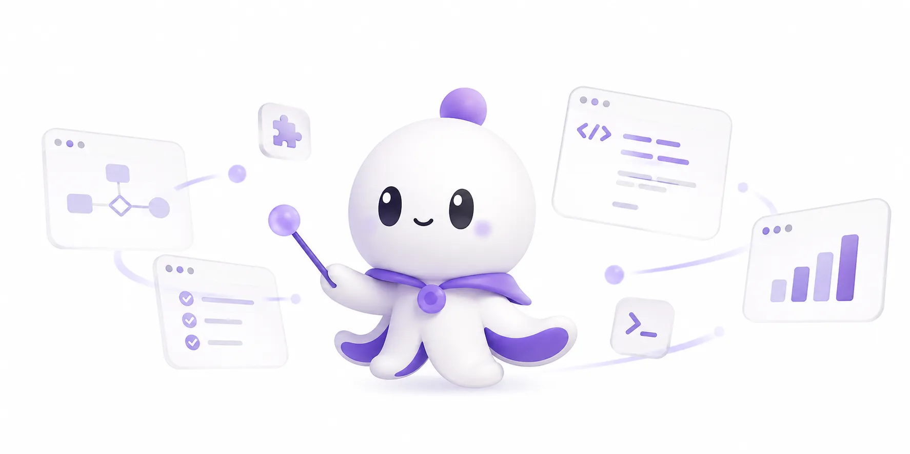

<div align="center">

# behest

**Rust-native building blocks for production AI agent runtimes**



[](https://github.com/lazhenyi/behest/actions/workflows/ci.yml)
[](#license)

**English** · [简体中文](README.zh-CN.md) · [繁體中文](README.zh-TW.md) · [Français](README.fr.md) · [日本語](README.ja.md) · [한국어](README.ko.md) · [Italiano](README.it.md)

</div>

---

## What this is

`behest` provides provider-neutral contracts for chat, streaming, tool calling, embeddings, runtime execution, storage, queues, RAG, observability, and optional gRPC serving.

It is designed for systems that need explicit control over model providers, tool execution, persistence, and operational boundaries — instead of opaque "agent framework" magic.

> Status: early foundation crate. Public APIs are intentionally compact, strongly typed, and documented.

## Why behest

**behest** /bɪˈhest/ — *n.* a person's orders or command.

> At the **behest** of the user, the agent acts.

The core of an agent runtime is not "autonomous consciousness" but controlled delegation: the user issues an intent, and the system composes context, invokes models, executes tools, persists state, publishes events within explicit boundaries — auditable, recoverable, constrainable, and replaceable.

The name `behest` deliberately avoids inflated metaphors like "brain / cognition / intelligence". It only states an engineering fact:

> tool-calling, streaming, memory, queue, RAG, snapshot — all mechanisms exist because someone gave an order.

## Design goals

- **Rust-native first**: typed APIs, explicit errors, no hidden runtime assumptions.
- **Provider-neutral core**: OpenAI, Anthropic, local models, proxies, or internal providers can implement the same contracts.
- **Streaming-first runtime**: the agent loop is designed around streamed model events, with non-streaming fallback where appropriate.
- **Typed tool boundary**: tools are described by JSON Schema and executed through explicit registries.
- **Pluggable persistence**: memory by default, external stores behind feature flags.
- **Operational surface**: event publishing, snapshots, session gates, compaction, retry policy, and optional gRPC server.
- **Small public API**: foundation primitives over framework sprawl.

## What's inside

| Area | Capability |
|---|---|
| Provider contracts | `ChatProvider`, `EmbeddingProvider`, request / response models, stream events, provider capabilities |
| Provider registry | In-memory routing for chat and embedding providers |
| Chat model types | messages, content parts, tool calls, response formats, token usage, finish reasons |
| Tool runtime | `Tool`, `FunctionTool`, `ExternalTool`, `ToolRegistry`, schema generation, execution dispatch |
| Agent runtime | context building, model calls, tool loop, session persistence, event emission |
| Runtime invocation | `RuntimeInvocation`, `EmitRequest`, `EventKind`, `Control`, transport-neutral emit/on facade |
| Runtime stream | `RuntimeEventStore`, `RuntimeStreamAdapter`, `RuntimeSubscriptionHub`, replay + live fanout |
| Reasoning graph | `ReasoningGraph`, `ReasoningOperator`, `ControlKind`, DAG-based reasoning strategies |
| Runtime safety | session gate, runtime policy, input admission, doom-loop detection, tool output truncation |
| Storage | memory stores, Redis, SQLx, MongoDB, SurrealDB, object storage, Qdrant embeddings |
| Context and RAG | context adapters, static/function adapters, optional RAG adapter |
| Queues | optional event publishing through NATS or Redis Streams |
| Configuration | builder, file-based config, environment variable loading, secret indirection |
| Server | optional gRPC server binary behind `server` feature |
| Observability | tracing and optional OpenTelemetry integration |

## Quick start

```toml
[dependencies]
behest = "0.2"
```

Create a provider-neutral chat request:

```rust
use behest::prelude::*;

let request = ChatRequest::new(ModelName::new("example-model"))
    .with_message(Message::system_text("You are concise."))
    .with_user_text("Summarize this project in one sentence.");
```

Register providers in a registry and route requests:

```rust
use behest::prelude::*;

let registry = ProviderRegistry::new();
let provider_id = ProviderId::new("my-provider");

// Register a ChatProvider implementation first.
// registry.register_chat(my_provider);

// Then route through the neutral registry.
// let response = registry.complete(&provider_id, request).await?;
```

More examples in [`examples/`](examples/).

## Implement a custom provider

`behest` does not force one vendor SDK into the core. Implement `ChatProvider` for any model backend, gateway, local inference service, or internal provider.

```rust
use async_trait::async_trait;
use behest::prelude::*;

struct EchoProvider {
    id: ProviderId,
}

#[async_trait]
impl ChatProvider for EchoProvider {
    fn id(&self) -> ProviderId {
        self.id.clone()
    }

    fn capabilities(&self) -> ProviderCapabilities {
        ProviderCapabilities::chat()
    }

    async fn complete(&self, request: ChatRequest) -> ProviderResult<ChatResponse> {
        Ok(ChatResponse {
            provider: self.id.clone(),
            model: request.model,
            message: Message::assistant_text("echo"),
            finish_reason: FinishReason::Stop,
            usage: None,
            raw: None,
        })
    }
}
```

Streaming providers can override `stream`.

## Define and execute tools

Tools are explicit runtime objects. Each tool exposes a stable name, a human-readable description, and a JSON Schema argument contract.

```rust
use behest::prelude::*;
use serde_json::{json, Value};

let tool = FunctionTool::new(
    "echo",
    "Echoes the input message.",
    json!({
        "type": "object",
        "properties": {
            "message": { "type": "string" }
        },
        "required": ["message"]
    }),
    |args: Value| async move {
        Ok(args.get("message").cloned().unwrap_or(Value::Null))
    },
)
.read_only()
.concurrency_safe();

let registry = ToolRegistry::new();
registry.register(tool);
```

Tool calls returned by a provider can be executed through the registry:

```rust
use behest::prelude::*;
use serde_json::json;

let call = ToolCall::new("call_1", "echo", json!({ "message": "hello" }));
let output = registry.execute(&call).await?;
```

## Runtime model

At the runtime layer, `AgentRuntime` orchestrates the full agent loop:

```text
RunRequest
  -> load or create session
  -> admit input
  -> build context
  -> call model provider
  -> stream / persist assistant output
  -> execute tool calls
  -> append tool results
  -> repeat until completion, limit, or error
  -> emit AgentEvent values
```

The runtime brings together:

- `ProviderRegistry`
- `ContextPipeline`
- `ToolRuntime`
- `RuntimeStore`
- `RuntimePolicy`
- `CompactionService`
- `SessionGate`
- optional event publisher
- optional snapshot store
- optional background job pool

## Configuration

`AgentConfig` supports layered configuration:

1. defaults
2. file sources
3. environment variables
4. manual builder setters

```rust
use behest::prelude::*;

let config = AgentConfig::builder()
    .with_file("behest.toml")?
    .with_env("BEHEST")?
    .build()?;

let runtime = config.into_runtime().await?;
```

Secrets can be loaded through `env:VAR_NAME` indirection:

```toml
[providers.openai]
api_key = "env:OPENAI_API_KEY"
```

See [`behest.toml` example](examples/hello_config.rs) for full configuration structure.

## Provider adapters

Concrete provider adapters are feature-gated.

| Feature | Adapter | Chat | Stream | Embeddings | Tools |
|---|---|---:|---:|---:|---:|
| `openai` | `OpenAiChatAdapter`, `OpenAiEmbeddingAdapter` | yes | yes | yes | yes |
| `anthropic` | `AnthropicChatAdapter` | yes | yes | no | yes |

Enable adapters:

```toml
[dependencies]
behest = { version = "0.2", features = ["openai", "anthropic"] }
```

## Feature flags

<details>
<summary>Click to expand full feature list</summary>

**Default:**

| Feature | Description |
|---|---|
| `tls-rustls` | Default TLS stack using rustls |

**Provider adapters:**

| Feature | Description |
|---|---|
| `openai` | OpenAI-compatible chat and embedding adapters |
| `anthropic` | Anthropic-compatible chat adapter |

**TLS:**

| Feature | Description |
|---|---|
| `tls-rustls` | Enable rustls TLS integration for HTTP / enabled backends |
| `tls-native` | Enable native TLS integration for HTTP / enabled backends |

**Storage:**

| Feature | Description |
|---|---|
| `redis` | Redis-backed store support and Redis Streams primitives |
| `redis-cluster` | Redis Cluster support; implies `redis` |
| `sqlx-postgres` | SQLx PostgreSQL store support |
| `sqlx-mysql` | SQLx MySQL store support |
| `sqlx-sqlite` | SQLx SQLite store support |
| `mongodb` | MongoDB session store support |
| `surrealdb` | SurrealDB session store support |
| `object_store` | Object storage support, including AWS S3 |
| `storage-all` | Redis, PostgreSQL, MySQL, SQLite, MongoDB, and SurrealDB storage features |

**RAG:**

| Feature | Description |
|---|---|
| `rag` | Core RAG context adapter |
| `qdrant` | Qdrant embedding store backend |
| `tantivy` | Tantivy backend support |
| `rag-all` | Enables `rag`, `qdrant`, and `tantivy` |

**Queues:**

| Feature | Description |
|---|---|
| `queue` | Core event publisher traits |
| `nats` | NATS event publisher |
| `queue-all` | Enables `queue`, `nats`, and `redis` |

**Server and observability:**

| Feature | Description |
|---|---|
| `server` | gRPC server binary and protobuf service layer |
| `otel` | OpenTelemetry tracing integration |

**Convenience profile:**

| Feature | Description |
|---|---|
| `full` | Opinionated full runtime profile: OpenAI, Anthropic, Redis, Redis Cluster, NATS, PostgreSQL, MongoDB, SurrealDB, OpenTelemetry, all RAG backends, all queue backends, and object storage. It intentionally does not enable `server`, `sqlx-mysql`, or `sqlx-sqlite`. |

</details>

Example with selected features:

```toml
[dependencies]
behest = {
    version = "0.2",
    default-features = false,
    features = ["tls-rustls", "openai", "anthropic", "redis", "queue", "nats"]
}
```

## Error model

`behest` exposes typed error categories instead of stringly framework failures:

- `ProviderError`
- `ToolError`
- `StorageError`
- `ContextError`
- `RuntimeError`
- top-level `Error`
- crate-level `Result<T>`

Provider errors distinguish unsupported capabilities, retryable failures, transport failures, invalid responses, and adapter-specific errors.

Tool errors distinguish missing tools, invalid arguments, execution failures, timeouts, and unimplemented external tools.

## Lint policy

The crate is intentionally strict:

- `unsafe_code = "forbid"`
- `missing_docs = "deny"`
- `unreachable_pub = "deny"`
- `clippy::all = "deny"`
- `dbg_macro = "deny"`
- `expect_used = "deny"`
- `todo = "deny"`
- `unimplemented = "deny"`
- `unwrap_used = "deny"`

This project treats public API clarity and failure-path hygiene as part of the runtime contract.

## Development

```bash
# Format
cargo fmt --all --check

# Check all targets and features
cargo check --all-targets --all-features --locked

# Lint
cargo clippy --all-targets --all-features --locked -- -D warnings

# Test
cargo test --all-features --locked

# Build documentation
RUSTDOCFLAGS="-D warnings" cargo doc --all-features --no-deps --locked
```

Run the complete local verification set:

```bash
cargo fmt --all --check && \
cargo check --all-targets --all-features --locked && \
cargo clippy --all-targets --all-features --locked -- -D warnings && \
cargo test --all-features --locked && \
RUSTDOCFLAGS="-D warnings" cargo doc --all-features --no-deps --locked
```

## License

Licensed under either of:

- Apache License, Version 2.0 ([LICENSE-APACHE](LICENSE-APACHE))
- MIT license ([LICENSE-MIT](LICENSE-MIT))

at your option.
